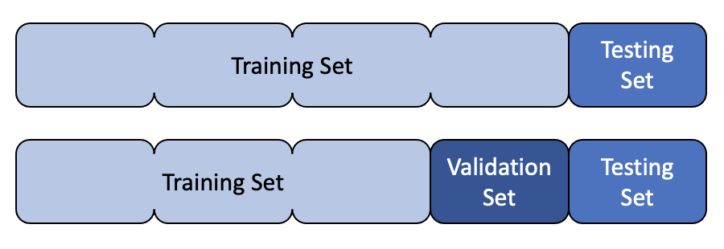

## Test/Train Split

Creating a model is all well and good, but how do we know that it is actually going to be useful in the real world? Essentially, we are asking how well does our model generalise to new data? To get an estimate of this, we can split our data into two sets: a training set and a test set. We can then train our model on the training set and evaluate it on the test set. This is known as the test/train split.

> ## What proportion of the data should be used for training?
>
> Discuss in small groups what proportion of data should be used for training. What are the advantages and disadvantages of using more or less data for training? If you have a lot of data, is it better to use more or less for training?
{: .discussion}

## Validation Set

Let's say we have two different models and we want to know which one to choose from, or maybe even two versions of the same type of model but with different hyperparameters, how do we know which one is best? At first this seems like a simple question, we just evaluate them on the test set and choose the one with the best performance. However, this is not a good idea. The test set is used to evaluate the final model, and so we should not use it to choose the model. If we do, we are likely to overfit to the test set and our model will not generalise well to new data.

Instead, we can split our data into three sets: a training set, a validation set and a test set. We can then train our models on the training set, evaluate them on the validation set and choose the best one. We can then evaluate the final model on the test set.

## Cross Validation

## Model Evaluation

## Bias and Variance



