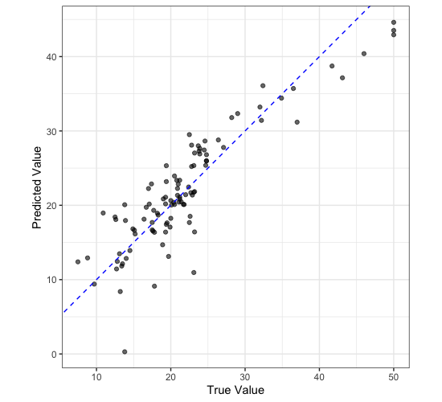

## Testing a Model

Up until this point we have not touched our testing data, this is good as we should not touch it until after we have performed model selection and training. Once you have a model that you are happy with then you can see how it performs on the testing data to get a idea as to how it will perform in the real world. For this example, we are going to pretend that we have decided we want to use our linear regression model.

So far we have been using the `fit()` function to fit our model. However, `tidymodels` has another function called `last_fit()` which will fit the model to the training data and then test it on the testing data. We can use this function just like we used `fit()`, but instead of passing in the training data (`housing_train`) we pass in the training and testing data in the form of the split object we made earlier (`housing_split`).

```r
housing_lin_reg_last_fit <- housing_wf |> 
  last_fit(housing_split)

housing_lin_reg_last_fit
```

```
# Resampling results
# Manual resampling 
# A tibble: 1 × 6
  splits            id               .metrics         .notes   .predictions       .workflow 
  <list>            <chr>            <list>           <list>   <list>             <list>    
1 <split [404/102]> train/test split <tibble [2 × 4]> <tibble> <tibble [102 × 4]> <workflow>
```
{: .output}

This is an object that contains our trained workflow, we can access the workflow by

```r
housing_lin_reg_last_fit |> 
  extract_workflow()
```

```
══ Workflow [trained] ══════════════════════════════════════════════════════════════════════
Preprocessor: Recipe
Model: linear_reg()

── Preprocessor ────────────────────────────────────────────────────────────────────────────
4 Recipe Steps

• step_log()
• step_nzv()
• step_normalize()
• step_dummy()

── Model ───────────────────────────────────────────────────────────────────────────────────

Call:
stats::lm(formula = ..y ~ ., data = data)

Coefficients:
(Intercept)         crim           zn        indus          nox           rm          age  
   22.51650      0.83052      0.96745      0.35432     -2.15434      2.73170     -0.04878  
        dis          rad          tax      ptratio            b        lstat      chas_X1  
   -2.72384      1.74809     -2.04659     -2.02828      0.99723     -4.26584      2.57621  
```
{: .output}

But the `last_fit()` function, as well as fitting the model, will evaluate your model on the testing data and provide you with metrics on how well it performed. We can access these metrics by using the `collect_metrics()` function.

```r
housing_lin_reg_last_fit |> 
  collect_metrics()
```

```
# A tibble: 2 × 4
  .metric .estimator .estimate .config             
  <chr>   <chr>          <dbl> <chr>               
1 rmse    standard       3.83  Preprocessor1_Model1
2 rsq     standard       0.791 Preprocessor1_Model1
```
{: .output}

> ## Is this model any good?
>
> Looking at these metrics, do you think that the model we have trained is any good? Why or why not?
{: .challenge}

We can also check whether there are any "structural errors" in our model by comparing plots of true and predicted values.

```r
housing_lin_reg_test_res <- housing_lin_reg_last_fit |> 
  extract_workflow() |> 
  predict(housing_test)

housing_lin_reg_test_res
```

```
# A tibble: 102 × 1
   .pred
   <dbl>
 1 20.4 
 2 21.7 
 3 18.9 
 4 16.2 
 5 13.9 
 6 11.4 
 7  8.39
 8 22.8 
 9 34.4 
10 25.4 
# ℹ 92 more rows
# ℹ Use `print(n = ...)` to see more rows
```
{: .output}

```r
housing_test |> 
  select(medv) |> 
  bind_cols(housing_lin_reg_test_res) |> 
  ggplot() +
  aes(
    x = medv,
    y = .pred
  ) +
  geom_point(
    alpha = 0.6
  ) +
  geom_abline(
    slope = 1,
    colour = "blue",
    lty = 2
  ) +
  labs(
    x = "True Value",
    y = "Predicted Value"
  ) +
  coord_equal() +
  theme_bw()
```



> ## Is this model any good?
>
> Looking at this plot, do you think that the model we have trained is any good? Why or why not?
{: .challenge}

## Saving a Model

Once you have a model that you are happy with, you can save it to disk so that you can use it later. To do this we use the `saveRDS()` function. The first argument is the object you want to save, the second argument is the path to the file you want to save it to. In this case we are going to save our linear regression model last fit object to a file called `model.rds`.

```r
saveRDS(
  housing_lin_reg_last_fit,
  "model.rds"
)
```

We can then read in this model again using the `readRDS()` function.

```r
model <- readRDS("model.rds")

model |> 
  extract_workflow()
```

```
══ Workflow [trained] ══════════════════════════════════════════════════════════════════════
Preprocessor: Recipe
Model: linear_reg()

── Preprocessor ────────────────────────────────────────────────────────────────────────────
4 Recipe Steps

• step_log()
• step_nzv()
• step_normalize()
• step_dummy()

── Model ───────────────────────────────────────────────────────────────────────────────────

Call:
stats::lm(formula = ..y ~ ., data = data)

Coefficients:
(Intercept)         crim           zn        indus          nox           rm          age  
   22.51650      0.83052      0.96745      0.35432     -2.15434      2.73170     -0.04878  
        dis          rad          tax      ptratio            b        lstat      chas_X1  
   -2.72384      1.74809     -2.04659     -2.02828      0.99723     -4.26584      2.57621
```
{: .output}


